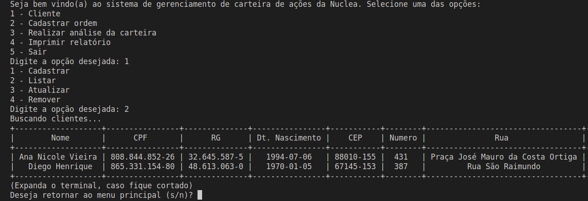
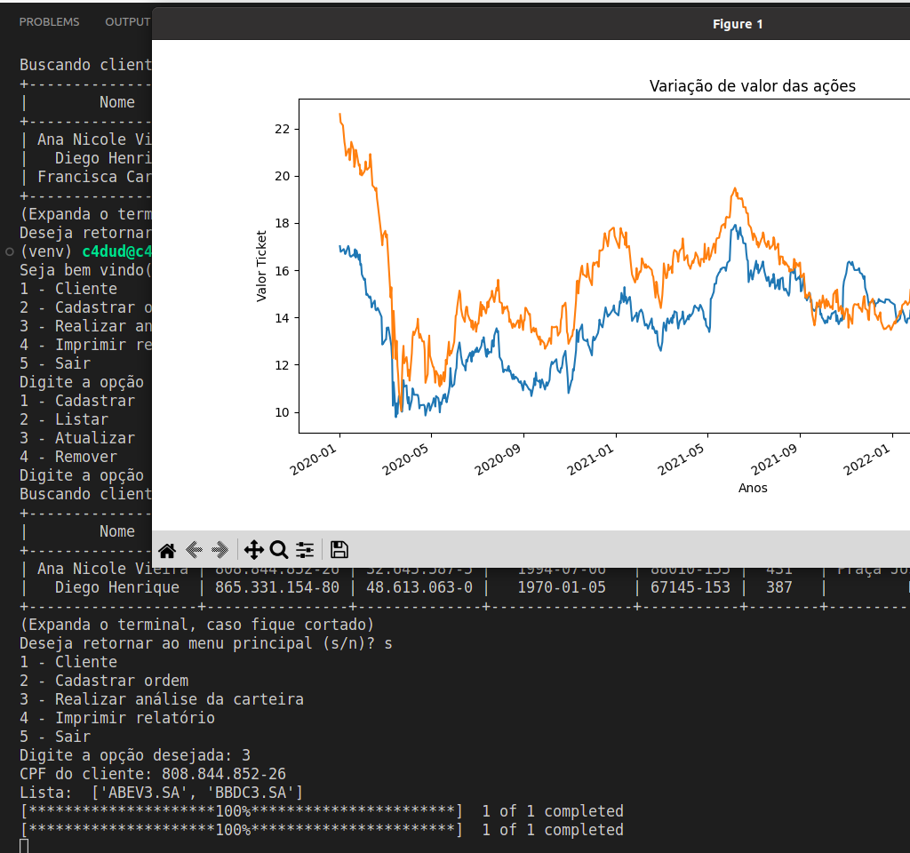

# Nuclea Python Finanças

Projeto desenvolvido no módulo de Python ministrado pelo professor Daniel Vieira ([@danielgundim](https://github.com/danielgundim)) na Formação DevOps através do programa Ser+Tech (Ada Tech + Núclea).


## Tech Stack

**Python 3.8**

**PostgreSQL**


## Variáveis de Ambiente

Para executar este projeto, você precisará adicionar as seguintes variáveis ​​de ambiente ao seu arquivo .env

`DB_USER= `

`DB_PASS=` 

`DB_HOST=` 

`DB_PORT=` 

`DB_NAME=` 


## Run Locally

Clone the project

```bash
  git clone https://github.com/caducoder/nuclea-python-financas.git
```

Go to the project directory

```bash
  cd nuclea-python-financas
```

Install dependencies

```bash
  pip install -r requirements.txt
```


## Running Tests

To run tests, run the following command

```bash
  python -m unittest discover
```


## Features

- Cadastro de clientes e ordens
- Busca do CEP na API da ViaCEP
- Geração de gráfico de preços das ações do cliente
- Geração de relatórios em arquivos de texto


## Screenshots


(dados fictícios)



